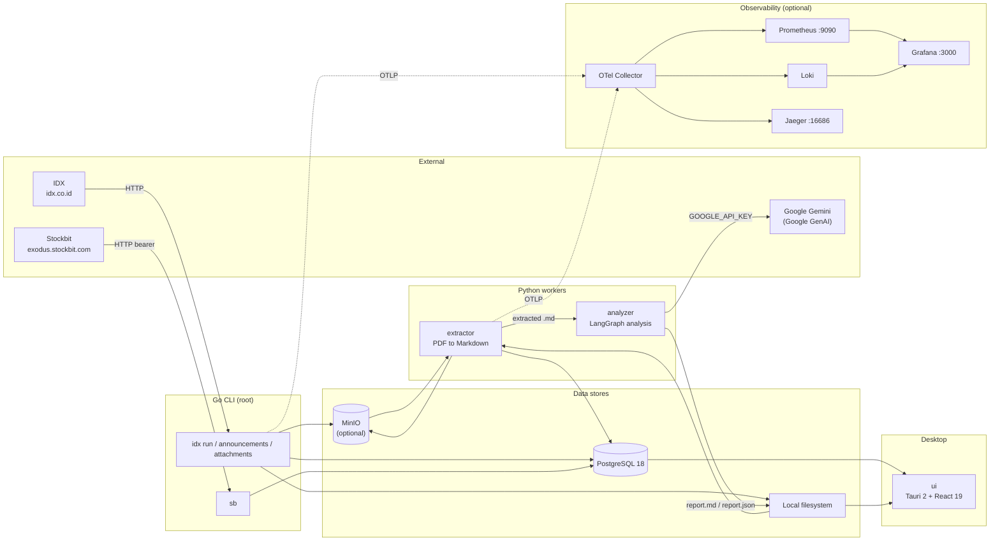

# bloodhound

Multi-component pipeline for collecting, extracting, analyzing, and exploring Indonesian Stock Exchange (IDX) financial disclosures.

Bloodhound fetches IDX announcements and attachments, stores them in PostgreSQL (and optionally MinIO), converts PDF filings to Markdown, runs LangChain/LangGraph analysis over the extracted documents, and presents results in a desktop UI. The repository is a monorepo: a Go worker CLI at the root, plus three git submodules for extraction, analysis, and the Tauri desktop app.

---

## Table of contents

- [Overview](#overview)
- [Architecture](#architecture)
- [Components](#components)
- [Prerequisites](#prerequisites)
- [Quick start](#quick-start)
- [Configuration](#configuration)
- [CLI reference](#cli-reference)
- [Database and migrations](#database-and-migrations)
- [Observability stack](#observability-stack)
- [Development](#development)
- [Tech stack](#tech-stack)
- [Project structure](#project-structure)
- [Issue tracking](#issue-tracking)
- [Contributing](#contributing)
- [License](#license)

---

## Overview

Bloodhound covers the full path from exchange disclosure to analysis:

1. **Ingest** — A Go CLI polls [idx.co.id](https://idx.co.id) for corporate announcements and downloads PDF (and other) attachments on a schedule.
2. **Store** — Metadata lands in PostgreSQL; file payloads go to local disk or MinIO (S3-compatible object storage).
3. **Extract** — A Python worker converts announcement PDFs to Markdown using Docling or liteparse and records extraction results in PostgreSQL.
4. **Analyze** — A LangGraph agent (Google Gemini via LangChain) reads Markdown/text filings and writes investment-oriented reports (`report.md` / `report.json`).
5. **Explore** — A Tauri 2 + React desktop app renders financial document sections and transaction graphs.
6. **Observe** — Optional Docker Compose services provide OpenTelemetry collection, Prometheus, Grafana, Loki, Jaeger, and node/postgres exporters.

A parallel **Stockbit** client path stores market-detector summaries and broker transactions from `https://exodus.stockbit.com` (requires a bearer token in configuration).

---

## Architecture



Notes on the diagram:

- MinIO is **commented out** in the root `docker-compose-dependency.yaml`; local disk storage is the default path in `bloodhound.yaml`.
- The extractor can run with local source/output paths only (`source.remote.enabled: false`, `output.remote.enabled: false` in `extractor/config.yaml`).
- Go workers also expose pprof on `:9999` (IDX run commands) and are configured for OpenTelemetry export via the `telemetry` block in `bloodhound.yaml`.

---

## Components

| Component | Path | Runtime | Role |
|-----------|------|---------|------|
| Worker CLI | repository root (`main.go`, `cmd/`, `internal/`) | Go 1.25 | IDX announcement/attachment fetcher and Stockbit integration worker |
| Extractor | [`extractor/`](./extractor) (git submodule) | Python ≥ 3.13 (uv) | PDF → Markdown extraction (Docling / liteparse), MinIO upload, PostgreSQL records |
| Analyzer | [`analyzer/`](./analyzer) (git submodule) | Python ≥ 3.13 (uv) | LangChain/LangGraph financial document analysis (Google GenAI), CLI `analyzer` |
| UI | [`ui/`](./ui) (git submodule) | Tauri 2 + React 19 + TypeScript | Desktop app for browsing extracted documents and graphs |
| Infra | `docker-compose.yaml` + included compose files | Docker Compose | Dependencies (Postgres) and observability stack |
| Migrations | [`migrations/`](./migrations) | golang-migrate | Versioned SQL schema for the Go app (applied automatically on connect) |

**Important:** `extractor/`, `analyzer/`, and `ui/` are **git submodules** (see `.gitmodules`). Clone with submodules or initialize them after cloning (see [Quick start](#quick-start)).

---

## Prerequisites

Install only what you need for the parts you run:

| Tool | Needed for | Notes |
|------|------------|--------|
| [Go](https://go.dev/) 1.25+ | Worker CLI | `go.mod` declares `go 1.25.0` |
| [Docker](https://docs.docker.com/) + Docker Compose | Postgres and observability | Compose files at repo root |
| [uv](https://docs.astral.sh/uv/) | Extractor and analyzer | Python projects use `uv.lock` |
| Python 3.13+ | Extractor / analyzer | `requires-python = ">=3.13"` |
| [Node.js](https://nodejs.org/) + [pnpm](https://pnpm.io/) | UI | `ui/package.json`, `pnpm-lock.yaml` |
| Rust toolchain + Cargo | UI (Tauri) | Required for `tauri dev` / `tauri build` |
| [golangci-lint](https://golangci-lint.run/) | Go lint/format targets | Used by root `Makefile` |
| Google AI API key | Analyzer | `GOOGLE_API_KEY` or `GEMINI_API_KEY` |
| Stockbit token (optional) | Stockbit worker | `app.stockbit.token` in `bloodhound.yaml` |

---

## Quick start

### 1. Clone (with submodules)

```bash
git clone --recurse-submodules https://github.com/Alturino/bloodhound.git
cd bloodhound
```

If you already cloned without submodules:

```bash
git submodule update --init --recursive
```

### 2. Environment and configuration

```bash
cp .env.example .env
```

Edit `.env` as needed (Postgres credentials, MinIO keys, timezone). Defaults match `docker-compose-dependency.yaml`:

- `POSTGRES_DB=bloodhound`
- `POSTGRES_USER=bloodhound`
- `POSTGRES_PASSWORD=bloodhound`
- `POSTGRES_PORT=5432`

Review root [`bloodhound.yaml`](./bloodhound.yaml). You will typically adjust:

- `database.*` — must match the running Postgres instance
- `storage.local.bloodhound_dir` — absolute path for local attachment storage (the checked-in value is machine-specific)
- `app.idx.*` — base URL, page size, scheduler interval/cron, worker pool sizes
- `app.stockbit.token` — leave empty unless you use the Stockbit worker

The Go CLI accepts `--config` (default `bloodhound.yaml`) and `--mock` (IDX mock mode). Viper also supports environment overrides with the `BLOODHOUND_` prefix (e.g. nested keys map `.` → `_`).

### 3. Start infrastructure

From the repository root:

```bash
docker compose up -d
```

`docker-compose.yaml` includes:

- `docker-compose-dependency.yaml` — PostgreSQL **18.4** (`postgres:18.4-trixie`), `postgres-exporter` (port **9187**); MinIO and Valkey services are present but **commented out**
- `docker-compose-observability.yaml` — OTel Collector, Grafana, Loki, Fluent Bit, Jaeger, Prometheus, node-exporter

`db_init/init.sh` runs on first Postgres init and creates dedicated application roles (extractor and analyzer users) when the corresponding env vars are set. See [Database and migrations](#database-and-migrations).

> **Note:** The checked-in compose file mounts a host-specific path for the Postgres data volume. Change `docker-compose-dependency.yaml` volumes to a path on your machine before first start if that path does not exist.

### 4. Run the Go workers

Build and run from the repository root (config path is relative to your working directory):

```bash
go build -o bloodhound .

# Both announcement + attachment pipelines
./bloodhound idx run

# Or run each pipeline separately
./bloodhound idx announcements   # aliases: ann, a
./bloodhound idx attachments     # alias: att

# Stockbit integration worker (requires app.stockbit.token and a reachable Postgres)
./bloodhound sb                  # aliases: sr; help Usage line shows "sb run"
```

Global flags (all commands):

| Flag | Default | Description |
|------|---------|-------------|
| `--config` | `bloodhound.yaml` | Path to YAML config file |
| `--mock` | `false` | Enable IDX mock mode (sets `app.idx.mock_mode`) |
| `-h`, `--help` | — | Command help |

IDX run commands start a pprof HTTP server on **`:9999`**.

Migrations run automatically when the app opens a database connection (`internal/db` uses golang-migrate with `database.migration_path`, default `file://migrations`).

### 5. Run the extractor

```bash
cd extractor
uv sync
cp .env.example .env   # optional; adjust as needed

# Download Docling model artifacts (Makefile target)
make download-models

# Run extraction (config path is required).
# main.py lives under src/; running it puts src/ on sys.path for local imports.
uv run python src/main.py --config config.yaml
```

`extractor/config.yaml` controls:

- **source** — local directory of PDFs; optional remote (MinIO) source bucket
- **output** — local Markdown output directory; optional remote (MinIO) output bucket
- **database** — PostgreSQL DSN fields (defaults use the `bloodhound_pdf_extractor` role)
- **extraction.engine** — `liteparse` (default in sample config) or `docling`
- **docling** — OCR, table structure, device (`cuda` / `auto`), artifacts path

`extractor/Dockerfile` declares `ENTRYPOINT ["python", "main.py"]` with default `CMD ["--config", "/app/config.yaml"]`. Compose helpers live in `extractor/docker-compose.yml` (Postgres + OTel Collector; MinIO and the extractor service are commented out).

### 6. Run the analyzer

```bash
cd analyzer
uv sync

# Requires a Google AI API key
export GOOGLE_API_KEY="..."   # or GEMINI_API_KEY

# Analyze a single Markdown/text document
uv run analyzer data/sample.txt --output-dir ./reports
```

Outputs:

- `./reports/report.md` — rendered Markdown report
- `./reports/report.json` — structured JSON report

Environment variables (from `analyzer/analyzer/config.py`):

| Variable | Required | Default | Purpose |
|----------|----------|---------|---------|
| `GOOGLE_API_KEY` | Yes (or `GEMINI_API_KEY`) | — | Google GenAI authentication |
| `GEMINI_API_KEY` | Fallback for API key | — | Used if `GOOGLE_API_KEY` unset |
| `ANALYZER_MODEL` | No | `gemini-2.5-flash` | LangChain model name |
| `ANALYZER_CHUNK_SIZE` | No | `4000` | Text splitter chunk size |
| `ANALYZER_CHUNK_OVERLAP` | No | `200` | Text splitter overlap |
| `ANALYZER_MAX_STEPS` | No | `12` | Agent step limit |
| `ANALYZER_RETRIES` | No | `2` | Retry count |

Batch corpus driver:

```bash
uv run python scripts/run_corpus.py \
  --input-dir /path/to/extracted \
  --output-dir /path/to/analyzed
```

### 7. Run the UI

```bash
cd ui
pnpm install

# Web frontend only (Vite dev server on port 1420)
pnpm dev

# Full Tauri desktop app (starts Vite via beforeDevCommand)
pnpm tauri dev

# Production build
pnpm tauri build
```

Tauri config (`ui/src-tauri/tauri.conf.json`): product name `bloodhound-ui`, dev URL `http://localhost:1420`, frontend dist `../dist`.

---

## Configuration

### Root: `bloodhound.yaml`

Primary configuration for the Go CLI. Structure (abridged from the checked-in file):

```yaml
app:
  name: bloodhound
  enabled: true
  environment: production
  log_level: 0
  log_dir: ./logs/
  idx:
    base_url: https://idx.co.id
    page_size: 1000
    scheduler:
      interval: 30s
      cron_expr: "*/15 * * * *"
    worker_pool:
      announcement_workers: 5
      attachment_workers: 15
  stockbit:
    base_url: https://exodus.stockbit.com
    token: ""

database:
  host: localhost
  port: 5432
  user: bloodhound
  password: bloodhound
  dbname: bloodhound
  sslmode: disable
  migration_path: file://migrations

storage:
  local:
    enabled: true
    bloodhound_dir: /path/to/local/storage   # change this
  minio:
    enabled: false
    endpoint: localhost:9000
    access_key: minioadmin
    secret_key: minioadmin
    bucket: bloodhound
    use_ssl: false

telemetry:
  # OpenTelemetry Configuration (otelconf) YAML — see bloodhound.yaml
  # Uses ${OTEL_SERVICE_NAME}, ${OTEL_ENVIRONMENT},
  # ${OTEL_TRACES_ENDPOINT}, ${OTEL_METRICS_ENDPOINT}
  # Includes a Prometheus development scrape endpoint on localhost:9091
```

Notable behaviors (from `internal/config`):

- Config file is required (`ReadInConfig`); missing file is an error.
- Hot reload: config file changes are watched (`viper.WatchConfig`); log level updates on change.
- Environment prefix: `BLOODHOUND_` with `.` → `_` replacement; `HOSTNAME` is bound to `app.hostname`.
- Telemetry subtree is parsed with `otelconf` (not mapstructure), including `${VAR}` substitution.

### Root: `.env`

Used by Docker Compose (`env_file`) and available to local tooling. Copy from `.env.example`:

| Group | Variables |
|-------|-----------|
| Timezone | `TZ`, `PGTZ` (default `Asia/Jakarta`) |
| Postgres | `POSTGRES_DB`, `POSTGRES_HOST`, `POSTGRES_USER`, `POSTGRES_PASSWORD`, `POSTGRES_PORT`, `POSTGRES_URL`, `POSTGRES_MIGRATION_PATH` |
| App DB roles | `POSTGRES_BLOODHOUND_PDF_EXTRACTOR_USER`, `POSTGRES_BLOODHOUND_PDF_EXTRACTOR_PASSWORD` |
| MinIO | `MINIO_ROOT_USER`, `MINIO_ROOT_PASSWORD`, `MINIO_ENDPOINT`, `MINIO_ACCESS_KEY`, `MINIO_SECRET_KEY`, `MINIO_USE_SSL`, `MINIO_UI_PORT`, `MINIO_CONSOLE_PORT`, `MINIO_VOLUMES` |

`db_init/init.sh` also references `POSTGRES_BLOODHOUND_PDF_ANALYZER_USER` / `POSTGRES_BLOODHOUND_PDF_ANALYZER_PASSWORD` for the analyzer database role; add those to `.env` if you rely on the init script’s analyzer grants.

### Extractor: `extractor/config.yaml` and `.env`

- YAML config is **required** on the CLI (`--config` / `-c`).
- `extractor/.env.example` includes Postgres, MinIO, and OpenTelemetry variables (`OTEL_EXPORTER_OTLP_ENDPOINT`, `OTEL_SERVICE_NAME=bloodhound-pdf-extractor`, `OTEL_TRACES_EXPORTER=otlp`).

### Analyzer: environment only

No YAML config; see the analyzer environment table above. Put secrets in `analyzer/.env` (loaded via `python-dotenv`) — do not commit real keys.

---

## CLI reference

Captured from `./bloodhound --help` and subcommand help on the current tree.

### Root

```text
bloodhound [command]

Aliases:
  bloodhound, bd

Available Commands:
  completion  Generate the autocompletion script for the specified shell
  help        Help about any command
  idx         IDX announcement fetcher
  sb          Run the stockbit worker service

Flags:
      --config string   config file path (default "bloodhound.yaml")
  -h, --help            help for bloodhound
      --mock            enable IDX mock mode
```

Long description: `IDX announcement fetcher and Stockbit integration worker`.

### `idx` — IDX announcement fetcher

```text
bloodhound idx [command]

Aliases:
  idx, i

Available Commands:
  announcements   Run idx announcements worker only
  attachments     Run idx attachments downloader only
  run             Run idx announcements and attachments workers
```

| Command | Aliases | Description |
|---------|---------|-------------|
| `bloodhound idx run` | `r` | Run both announcement and attachment workers |
| `bloodhound idx announcements` | `ann`, `a` | Announcements worker only |
| `bloodhound idx attachments` | `att` | Attachments downloader only |

> The announcements and attachments workers are **siblings under `idx`**, not subcommands of `idx run`. Use `bloodhound idx ann`, not `bloodhound idx run ann`.

### `sb` — Stockbit worker

```text
Usage:
  bloodhound sb run [flags]

Aliases:
  sb, sr

Flags:
  -h, --help   help for sb
```

Invoke as `bloodhound sb` or `bloodhound sr` (cobra registers the command as `sb`; the usage line displays `sb run` because of the command’s `Use` string).

### Extractor CLI

```bash
uv run python src/main.py --config PATH
# or, from an environment where main.py is on the path:
python main.py --config PATH
```

`--config` / `-c` is **required**.

### Analyzer CLI

```text
usage: analyzer [-h] [--output-dir OUTPUT_DIR] file

positional arguments:
  file                  Path to the financial document (.txt or .md)

options:
  --output-dir OUTPUT_DIR
                        Directory for report.md and report.json (default: ./reports)
```

Console script name: `analyzer` (`[project.scripts]` in `analyzer/pyproject.toml`).

---

## Database and migrations

### Engine

- **PostgreSQL 18** (compose image: `postgres:18.4-trixie`)
- Healthcheck: `pg_isready`
- Init scripts: `db_init/` → `/docker-entrypoint-initdb.d`
- Optional host config templates: `pg_conf/` (commented out in compose)

### Schema migrations (Go app)

- Tool: [golang-migrate](https://github.com/golang-migrate/migrate)
- Directory: `migrations/`
- Config key: `database.migration_path` (example: `file://migrations`)
- Applied automatically in `db.Get` → `migrateUp()` on every successful connect (`migration.Up()`, tolerating `ErrNoChange`)

Migration pairs currently in `migrations/`:

| Migration | Tables |
|-----------|--------|
| `20260328055240_create_table_announcements` | `announcements` |
| `20260328055351_create_table_attachments` | `attachments` |
| `20260408105000_create_market_detectors` | market detector / broker transaction tables |
| `20260605063603_create_extracted_attachments` | `extracted_attachments` |

Each has `.up.sql` and `.down.sql`.

After migrations apply, the Go app regenerates go-jet models under `internal/db/.gen/` from live database metadata.

### Application roles

`db_init/init.sh` creates:

- Extractor role from `POSTGRES_BLOODHOUND_PDF_EXTRACTOR_*` (SELECT/INSERT/UPDATE on `public` tables)
- Analyzer role from `POSTGRES_BLOODHOUND_PDF_ANALYZER_*` (same grants)

### Extractor reference DDL

`extractor/schema.sql` documents the `extracted_attachments` table (PostgreSQL 18 `uuidv7()`).

### Maintenance script

`scripts/cleanup-non-pdf-attachments.sql` — one-off destructive cleanup of non-PDF attachment rows. Read the header before running; take a backup first.

---

## Observability stack

Started via root Docker Compose (`docker-compose-observability.yaml`). Config lives under [`observability/`](./observability).

| Service | Image (compose) | Host port(s) | URL / endpoint |
|---------|-----------------|--------------|----------------|
| Grafana | `grafana/grafana:11.3.0-ubuntu` | **3000** | http://localhost:3000 |
| Prometheus | `prom/prometheus:v3.5.4` | **9090** | http://localhost:9090 |
| Jaeger | `jaegertracing/all-in-one:1.62.0` | **16686** | http://localhost:16686 |
| Loki | `grafana/loki:3.3.2` | **3100** | http://localhost:3100 |
| OTel Collector | `otel/opentelemetry-collector-contrib` | **4317** (gRPC), **4318** (HTTP), 8888, 8889, 13133, 1888 | OTLP endpoints |
| Fluent Bit | `fluent/fluent-bit:5.0.1` | **24224** | Log shipping (mounts `logs/` and Docker socket) |
| node-exporter | `prom/node-exporter:v1.8.2` | **9100** | Host metrics |
| postgres-exporter | `prometheuscommunity/postgres-exporter:v0.19.0` | **9187** | Postgres metrics |

Grafana provisioning:

- Datasources: `observability/grafana/provisioning/datasources.yaml`
- Dashboards: `observability/grafana/dashboards/` (`loki.json`, `postgres.json`, `node-exporter.json`, `redis_valkey.json`)
- Anonymous auth is enabled with **Admin** org role (dev-oriented; do not expose publicly)

OTel Collector pipelines (`observability/otel-collector.yaml`):

- **traces** → Jaeger (`jaeger:4317`)
- **metrics** → Prometheus OTLP (`prometheus:9090/api/v1/otlp`)
- **logs** → Loki OTLP (`loki:3100/otlp`)

Application-side:

- Go: OTLP gRPC exporters configured in `bloodhound.yaml` `telemetry` (endpoints from env); optional Prometheus pull scrape on **localhost:9091** (`prometheus/development` reader)
- IDX run commands: pprof on **:9999**
- Extractor: `OTEL_EXPORTER_OTLP_ENDPOINT` (default `http://localhost:4317`)

Promtail config exists (`observability/promtail.yaml`) but the Promtail service is **commented out**; Fluent Bit is the active log shipper in compose.

---

## Development

### Go (repository root)

```bash
# Lint
make lint          # golangci-lint run ./...
make lint-fix      # golangci-lint run --fix ./...
make fmt           # golangci-lint fmt ./...

# Tests
go test ./...
```

Lint configuration: `.golangci.yml` (enables govet, staticcheck, errcheck, revive, gocritic, and others; `run.tests: true`).

Mock generation config: `.mockery.yml`.

### Extractor (`extractor/`)

```bash
cd extractor
uv sync
make download-models    # docling-tools models download
# Dev dependency group includes pytest / pytest-asyncio
uv run --group dev pytest
```

There is no dedicated `tests/` tree checked in at the extractor root beyond package layout; confirm test locations before relying on a full suite. Static typing configs: mypy / ty in `pyproject.toml`.

### Analyzer (`analyzer/`)

```bash
cd analyzer
uv sync
uv run pytest
```

Tests under `analyzer/tests/` (unit tests plus an integration test skipped when `GOOGLE_API_KEY` / `GEMINI_API_KEY` is unset). Fixtures under `analyzer/tests/fixtures/`.

### UI (`ui/`)

```bash
cd ui
pnpm install
pnpm test           # vitest run
pnpm test:watch     # vitest
pnpm build          # tsc && vite build
pnpm dev            # vite
pnpm tauri dev      # desktop dev
```

Vitest config includes `src/**/*.test.ts` (e.g. `src/parse.test.ts`, `src/graph/layout.test.ts`, `src/graph/transform.test.ts`).

Editorconfig (root): 2-space indent by default; tabs for Go/`Makefile`; Markdown keeps trailing whitespace rules relaxed per `.editorconfig`.

---

## Tech stack

| Layer | Technologies |
|-------|----------------|
| Worker CLI | Go 1.25, Cobra, Viper, golang-migrate, go-jet, otelsql, OpenTelemetry, MinIO client, lumberjack, slog |
| Extractor | Python 3.13, uv, Docling, liteparse, asyncpg, MinIO SDK, structlog, OpenTelemetry, aiohttp |
| Analyzer | Python 3.13, uv, LangChain, LangGraph, langchain-google-genai, Pydantic, python-dotenv |
| UI | Tauri 2, React 19, TypeScript, Vite 7, Tailwind CSS 4, TanStack Query, Zustand, XY Flow, Vitest, pnpm |
| Data | PostgreSQL 18, MinIO (optional), golang-migrate |
| Infra | Docker Compose, OTel Collector, Prometheus, Grafana, Loki, Fluent Bit, Jaeger, node-exporter, postgres-exporter |
| Issue tracking | [Beads](https://github.com/gastownhall/beads) (`bd`) |

---

## Project structure

```text
bloodhound/
├── main.go                 # CLI entrypoint (cobra RootCmd)
├── cmd/                    # Cobra commands: root, idx (+ run/announcements/attachments), sb
├── internal/
│   ├── blobstorage/        # Local / MinIO / noop storage backends
│   ├── config/             # Viper + otelconf configuration
│   ├── db/                 # Connection, migrations, go-jet generation (.gen/)
│   ├── idx/                # IDX client, schedulers, worker pools, stores
│   ├── stockbit/           # Stockbit client and market-detector worker
│   ├── store/              # Shared persistence helpers
│   ├── telemetry/          # OpenTelemetry setup
│   ├── log/, httpclient/, models/, constants/
├── migrations/             # golang-migrate SQL (up/down)
├── db_init/                # Postgres first-boot role setup
├── pg_conf/                # Optional postgres config templates
├── scripts/                # One-off SQL utilities
├── observability/          # Collector, Grafana, Loki, Prometheus, Fluent Bit configs
├── docs/                   # Design docs, plans, styleguide
├── dummy/                  # Sample announcement JSON fixtures
├── extractor/              # Submodule — PDF extraction service
├── analyzer/               # Submodule — LangGraph analyzer
├── ui/                     # Submodule — Tauri desktop app
├── bloodhound.yaml         # Primary Go app config
├── .env.example            # Compose/env template
├── docker-compose.yaml     # include: dependency + observability
├── docker-compose-dependency.yaml
├── docker-compose-observability.yaml
├── Makefile                # lint / lint-fix / fmt
├── go.mod / go.sum
├── AGENTS.md               # Agent + Beads workflow instructions
└── README.md
```

---

## Issue tracking

This repository uses **[Beads](https://github.com/gastownhall/beads) (`bd`)** for durable issue tracking (not markdown TODO lists). See [`AGENTS.md`](./AGENTS.md) for the full workflow.

Common commands:

```bash
bd ready              # Unblocked work
bd show <id>          # Issue details
bd update <id> --claim
bd close <id>
bd prime              # Refresh Beads context
```

---

## Contributing

1. Fork and clone with submodules (`git clone --recurse-submodules ...`).
2. Create a feature branch.
3. Follow the component’s development commands above (Go: `make lint` + `go test`; Python: `uv run pytest`; UI: `pnpm test`).
4. File or claim work with Beads (`bd create` / `bd update --claim`) rather than ad-hoc TODO comments.
5. Open a pull request against `Alturino/bloodhound` with a clear description of behavior changes and how you validated them.

Do not commit secrets (`.env` files with real keys, Stockbit tokens, Google API keys). `.env` is gitignored; keep it that way.

---

## License

This project is licensed under the **MIT License**.

```text
MIT License

Copyright (c) 2026 Ricky Alturino

Permission is hereby granted, free of charge, to any person obtaining a copy
of this software and associated documentation files (the "Software"), to deal
in the Software without restriction, including without limitation the rights
to use, copy, modify, merge, publish, distribute, sublicense, and/or sell
copies of the Software, and to permit persons to whom the Software is
furnished to do so, subject to the following conditions:

The above copyright notice and this permission notice shall be included in all
copies or substantial portions of the Software.

THE SOFTWARE IS PROVIDED "AS IS", WITHOUT WARRANTY OF ANY KIND, EXPRESS OR
IMPLIED, INCLUDING BUT NOT LIMITED TO THE WARRANTIES OF MERCHANTABILITY,
FITNESS FOR A PARTICULAR PURPOSE AND NONINFRINGEMENT. IN NO EVENT SHALL THE
AUTHORS OR COPYRIGHT HOLDERS BE LIABLE FOR ANY CLAIM, DAMAGES OR OTHER
LIABILITY, WHETHER IN AN ACTION OF CONTRACT, TORT OR OTHERWISE, ARISING FROM,
OUT OF OR IN CONNECTION WITH THE SOFTWARE OR THE USE OR OTHER DEALINGS IN THE
SOFTWARE.
```
